# Interface User Task Documents

## **Introduction: Audience and Summary**

This task documentation is for interface (end) users with minimal programming experience who want to interact with the My Favorite Albums interface with the duplicate source code and the included music data through RStudio. 

In these guides, users in this audience will learn how to:

* Install R and R Studio  
* Retrieve and retrieve clone the software data  
* Create a new project on RStudio using the cloned source code   
* Generate the application interface through RStudio  
* Navigate the user interface of the My Favorite Albums application 

## **Install R and RStudio** 

This guide will walk you through installing R and RStudio. 

1. Navigate to the [RStudio Desktop page](https://posit.co/download/rstudio-desktop/).  

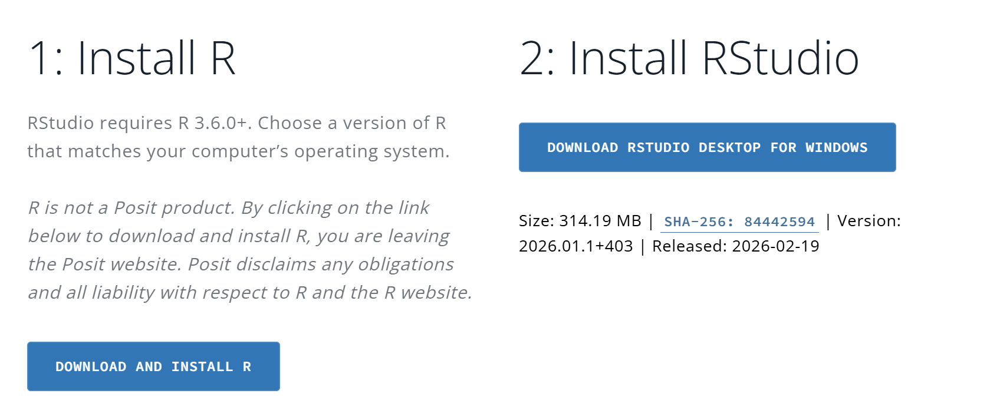
   
2. Install R:   
   a. On the RStudios Desktop Page, click on the blue button that reads **Download and Install R**, then select the operating system of your choice.

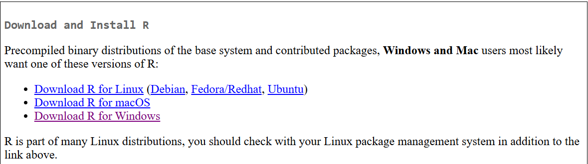

   b. Select **install R for the first time**.

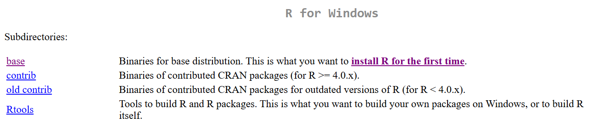
   
2. Install RStudio:  
   1. On the RStudios Desktop Page, click on the blue button that reads **Download RStudio Desktop**.
   2. Click on the downloaded file and allow RStudio to install.

## **Retrieve and clone the software source code** 

This guide will walk you through retrieving the software that is My Favorite Albums. 

> **Note**: Install the required packages through RStudio (dplyr, shiny, ggplot2) onto your device to clone and save software files. 

1. Navigate to the [GitHub page](https://github.com/UW-Example-Student/MyFavoriteAlbums) containing the source code. 
2. Select green “Code” button to download the data by copying the site link.

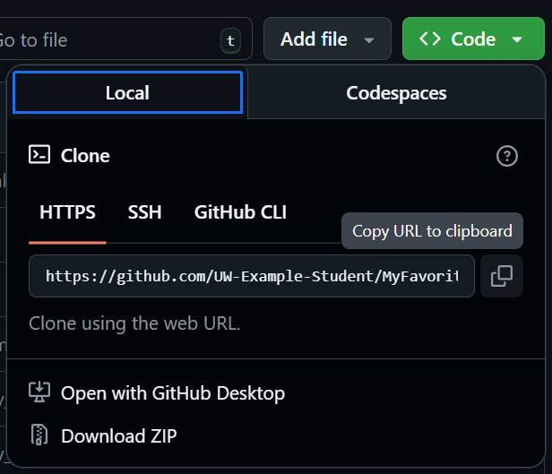

3. Paste the site link into shell-based terminal to clone by entering the command line:   
   > `git clone \<URL\>`
4. Save the clone file “My Favorite Albums” onto your device. 

## **Create a new project on RStudio using the cloned source code**

This guide will walk you through installing the cloned source code of the software My Favorite Albums into RStudio. 

1. Open RStudio.
2. On the top left corner, click on **File**.
   1. Select **New Project…**.
   2. Select **Existing Repository**.
   3. Select clone file "My Favorite Albums".  
3. Once a new project is created with the source code, select desired files from the files tab (bottom right panel) to view the code in the viewer tab (upper left panel) of RStudio.
4. Install packages and libraries when using command:
   > `install.packages()` and `library()`

## **Generate the application interface through RStudio**

This guide will walk you through generating a page interface of My Favorite Albums on RStudio using the included sample CSV file. 

1. Open RStudio.
2. In the files tab (bottom right panel), select **app.R** file.
3. In the viewer tab (upper left panel), select **Run App** to generate a My Favorite Albums application interface within RStudio.

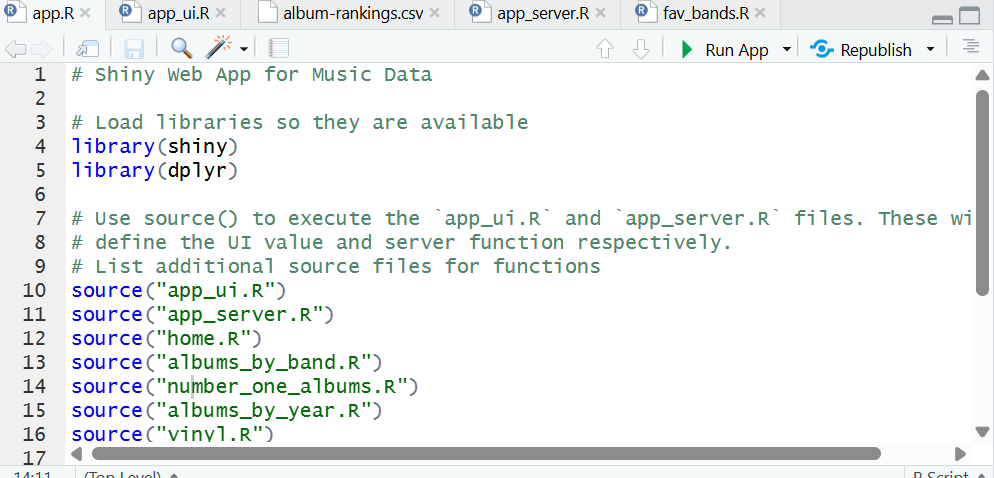
   > Optional: To open in a browser, select **Open in Browser** within the page generated on RStudio.

## **UI Guide for Number One Albums** 

This guide will walk you through the **Number One Albums** tab. 

1. On the My Favorite Albums page, select **Number One Albums** to navigate to the tab.
2. To view number one albums for multiple years, adjust the slider as desired. 

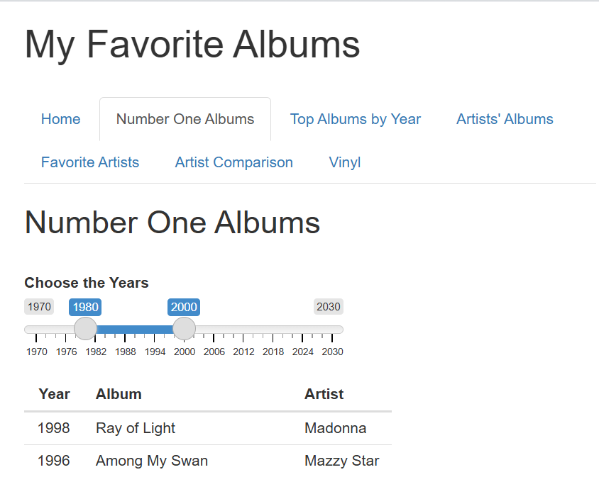

> Feedback Statement: A table of number one albums for each year selected will be displayed below the slider, showing the year, album name, and artist.

## **UI Guide for Top Albums by Year** 

This guide will walk you through the **Top Albums by Year** tab. 

1. On the My Favorite Albums page, select **Top Albums by Year** to navigate to the tab.
2. Select desired year from dropdown list and click **submit**.

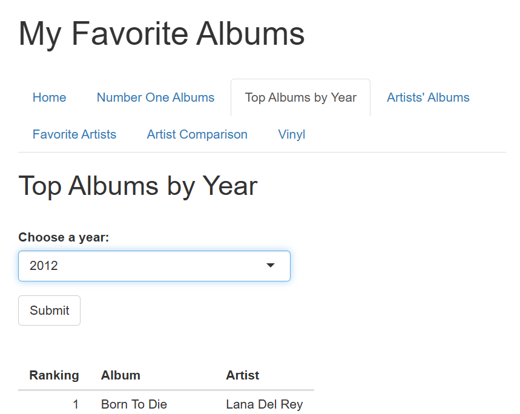

> A table of your top albums for that year will be displayed below the menu, showing the ranking for the albums included in that year.

## **UI Guide for Artists’ Albums** 

This guide will walk you through the **Artists’ Albums** tab. 

1. On the My Favorite Albums page, select **Artists’ Albums** to navigate to the tab.
2. Select desired band or artist from dropdown list and click **submit**. 

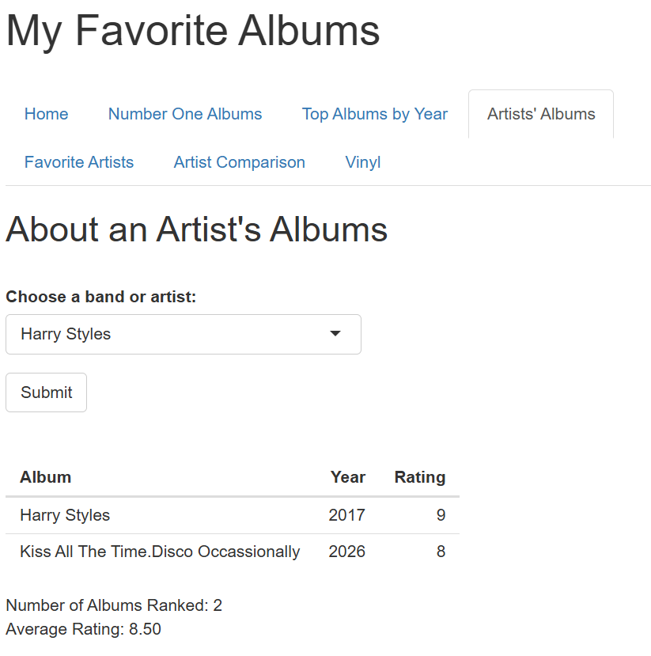

> A table of the chosen artists’ included albums will be displayed below, showing the album, the year of its release, its rating for that year, the number of albums ranked, and the average rating.

## **UI Guide for Favorite Artists**  

This guide will walk you through the **Favorite Artists** tab. 

1. On the My Favorite Albums page, select **Favorite Artists** to navigate to the tab. 
2. Select minimum number of albums from dropdown list and click **submit**. You can also type in the artist's name and click **submit**. 
   - Optional: Select to exclude EPs and Live Albums by clicking on the checkbox.

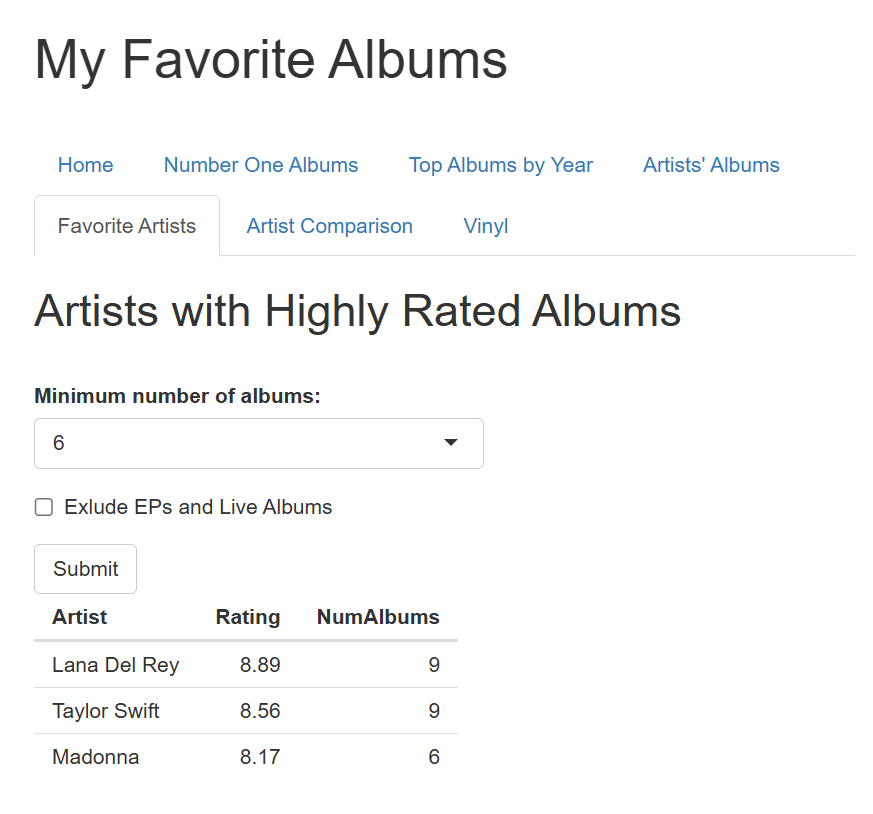

> A table will be displayed below showing the artist, their average rating, and the number of their albums included over the criteria set 

## **UI Guide for Artist Comparison** 

This guide will walk you through the **Artist Comparison** tab. 

1. On the My Favorite Albums page, select **Artist Comparison** to navigate to the tab. 
2. Select first and second bands and artists to compare using the respective dropdown lists.

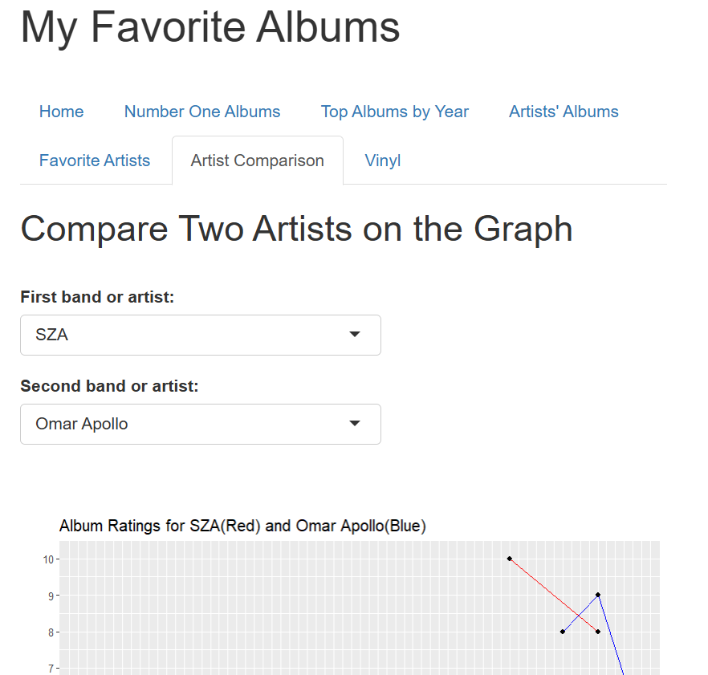

> The graph below will show the first band in red and the second band in blue, graphing the artists’ album ratings across their years.

## **UI Guide for Vinyl** 

This guide will walk you through the **Vinyl** tab. 

1. On the My Favorite Albums page, navigate to the **Vinyl** tab. 
2. Using the dropdown menu, select which albums to display based on album ratings and click **submit**. 

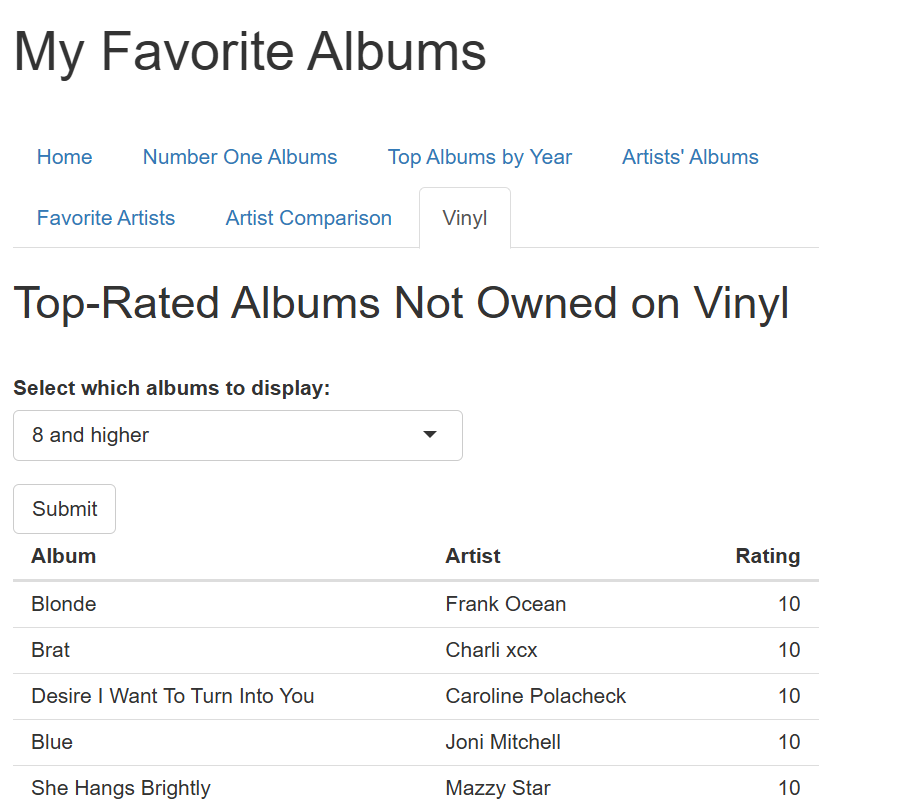

> The table below will display a ranking of top-album ratings for albums not owned on vinyl. 

# 

#  Code User Task Documents

## ***Introduction: Audience and Summary***

This task documentation is for code users with minimal to familiar experience with software and programming languages who want to use the My Favorite Albums software to learn and edit its language and use their own music data. 

In these guides, users in this audience will learn how to: 

* Install R and R Studio  
* Retrieve and retrieve clone the software data  
* Create a new project on RStudio using the cloned source code   
* Edit the music data of the CSV file   
* Edit the numerical ranges of the interface tools on the Number One Albums and Artist Comparison tabs   
* Generate the application interface through RStudio

## **Install R and RStudio** 

This guide will walk you through installing R and RStudio. 

1. Navigate to the [RStudio Desktop page](https://posit.co/download/rstudio-desktop/).  


   
2. Install R:   
   a. On the RStudios Desktop Page, click on the blue button that reads **Download and Install R**, then select the operating system of your choice.


   b. Select **install R for the first time**.


   
2. Install RStudio:  
   1. On the RStudios Desktop Page, click on the blue button that reads **Download RStudio Desktop**.
   2. Click on the downloaded file and allow RStudio to install.

## **Retrieve and clone the software source code** 

This guide will walk you through retrieving the software that is My Favorite Albums. 

> **Note**: Install the required packages through RStudio (dplyr, shiny, ggplot2) onto your device to clone and save software files. 

1. Navigate to the [GitHub page](https://github.com/UW-Example-Student/MyFavoriteAlbums) containing the source code. 
2. Select green “Code” button to download the data by copying the site link.


3. Paste the site link into shell-based terminal to clone by entering the command line:   
   > `git clone \<URL\>`
4. Save the clone file “My Favorite Albums” onto your device. 

## **Create a new project on RStudio using the cloned source code**

This guide will walk you through installing the cloned source code of the software My Favorite Albums into RStudio. 

1. Open RStudio.
2. On the top left corner, click on **File**.
   1. Select **New Project…**.
   2. Select **Existing Repository**.
   3. Select clone file "My Favorite Albums".  
3. Once a new project is created with the source code, select desired files from the files tab (bottom right panel) to view the code in the viewer tab (upper left panel) of RStudio.
4. Install packages and libraries when using command:
   > `install.packages()` and `library()`

## **Edit the music data**

This guide will walk you through editing the data contained in the CSV file on RStudio.

> **Note**: Each music entry must have the first five columns (categories) filled out for the application interface to generate.

1. In the bottom-right files tab, select the **Data** folder containing the album rankings CSV file to open it in the upper-left viewer tab.   
2. In the upper-left viewer tab, delete all lines except for the first containing the category columns.   
3. Enter your own music data by writing each entry in the order of the format. 

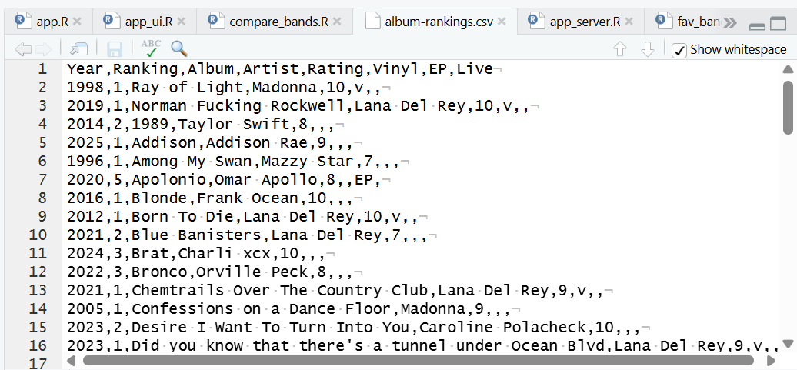

## **Edit the numerical ranges of the interface tools for the Number One Albums and Artist Comparison tabs**

This guide will walk you through editing the numerical ranges of the slider function on the **Number One Albums** tab and the **Artist Comparison** tab. 

For the slider on the **Number One Albums** tab: 

1. In the bottom-right files tab, select **app\_ui.R** to open up this file in the viewer tab.  
2. In the upper-left viewer tab, find the following lines: 

```r
tabPanel("Number One Albums",
                 htmlOutput("text3"),
                 sliderInput("rng", "Choose the Years", value = c(1970, 2030), min = 1970, max = 2030, sep = ""),
                 tableOutput("number_one_table")),
```

3. Edit minimum and maximum values to desired range of years. 

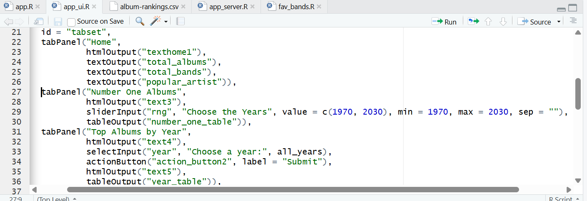

For the graph on the **Artist Comparison** tab:

1. In the bottom-right files tab, select **compare\_bands.R** to open up this file in the viewer tab.   
2. In the upper-left viewer tab, find line: 

   ```r
   scale\_x\_continuous(breaks=seq(1993,2024,1))+

       scale\_y\_continuous(breaks=seq(0,10,1))+

       expand\_limits(x=c(1993,2024), y=c(0,10))
   ```

3. Edit minimum and maximum values to desired range of years.

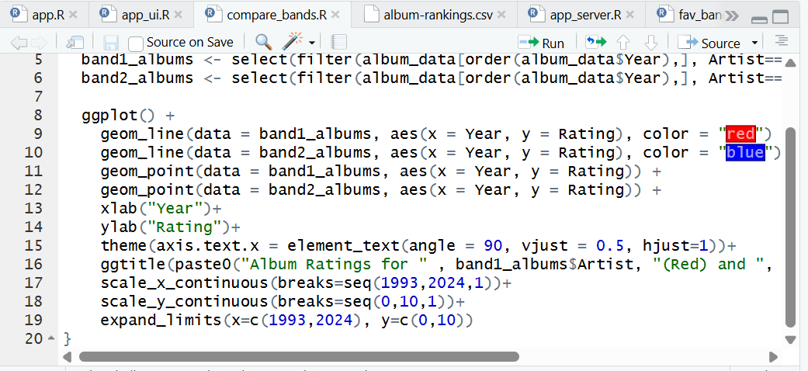

## **Generate the application interface through RStudio**

This guide will walk you through generating a page interface of My Favorite Albums on RStudio using the included sample CSV file. 

1. Open RStudio.
2. In the files tab (bottom right panel), select **app.R** file.
3. In the viewer tab (upper left panel), select **Run App** to generate a My Favorite Albums application interface within RStudio.


   > Optional: To open in a browser, select **Open in Browser** within the page generated on RStudio.
