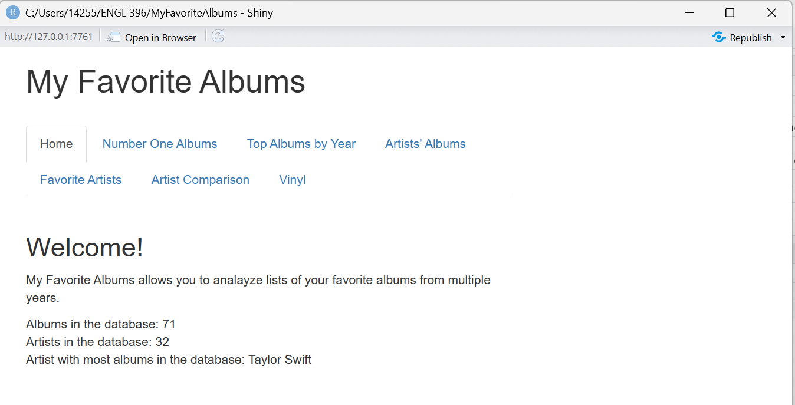

# Conceptual Overviews

## **Overview**

The purpose of this introductory page is to outline and briefly summarize topics for interface users and code users. The two types of audiences, their related topics, and a note on the software are summarized as follows: 

## ***Interface Users***

Interface users are users who want to interact with *My Favorite Albums* using the cloned source code. Users in this audience can use the software to explore its interface and see how music data is displayed through the various categories, filters, and graphs. In this document, users will learn: 

- What My Favorite Albums is   
- How My Favorite Albums works
- An overview of each of the categories of the interface of My Favorite Albums 

## ***Code Users*** 

Code users are users who want to use My Favorite Albums to access its software for their learning, use, and analysis. Users in this audience can use the software to learn and utilize its code to learn more of the language (R), as well as sort and analyze their own music data to launch a personalized application. In this document, users will learn:   
- What My Favorite Albums is from a developer perspective
- How My Favorite Albums works
- Why choose My Favorite Albums software

## ***What This Software Can and Cannot Do***

This software can sort, filter, and analyze music data through RStudio. This software can also generate a user-interface page displaying the data. Additionally, the software’s code can be edited in RStudio to customize and edit the functions on the user’s interface. This software cannot be run on other Integrated Development Environments unless its source code (written in R) is re-written in another language. 

# 

# Interface User Conceptual Overviews 

## **What is My Favorite Albums?** 

My Favorite Albums is a software tool that can sort, filter, and analyze music data stored in a CSV file. This data consisting of musical artists and albums is displayed through an application interface, launched from RStudio, consisting of several categories, graphs, and adjustable filters. The data is displayed across the included categories: **Home, Number One Albums, Top Albums by Year, Artists’ Albums, Favorite Artists, Artist Comparison, and Vinyl**.

## **How does My Favorite Albums work?** 

Users can use My Favorite Albums by downloading the source code as a cloned file to run it on RStudio. My Favorite Albums works with the included CSV file but also supports the user’s own music data, also stored in a CSV file, through R and RStudio. The default categories include year, ranking, album, artist, rating, vinyl, EP, and Live, which are displayed through the application interface launched through RStudio. 

## **Conceptual overview of *My Favorite Album*’s categories**

* **Home** displays total albums and artists and the artist with the most albums in the database.  
* **Number One Albums** displays an adjustable timeline consisting of number one albums spanning across the years provided by the data.  
* **Top Albums by Year** displays a list of top albums per year selected.  
* **Artist’s Albums** displays album information by the artist selected.  
* **Favorite Artists** displays an artist’s overall album rankings with the option to exclude EPs and live albums.  
* **Artist Comparison** allows the user to compare album ratings between artists displayed by a graph.  
* **Vinyl** displays top-rated albums not owned on vinyl across by ranking.

# Code Users Conceptual Overviews 

## **What is *My Favorite Albums*?** 

My Favorite Albums is a software tool, written in R and run on RStudio, that can sort, filter, and analyze music data stored in a CSV file. This data consisting of musical artists and albums is displayed through an application interface, launched from R Studio, consisting of several categories, graphs, and adjustable filters. The data is displayed across the included categories: **Home, Number One Albums, Top Albums by Year, Artists’ Albums, Favorite Artists, Artist Comparison, and Vinyl**.  

## **How does My Favorite Albums work?** 

My Favorite Albums is a software written in R for RStudio that uses musical data stored in a CSV file. Users can use My Favorite Albums by downloading the source code as a cloned file to run it on RStudio. My Favorite Albums works with the included CSV file but also supports the user’s own music data, also stored in a CSV file, through R and RStudio. The default categories include year, ranking, album, artist, rating, vinyl, EP, and Live, which are displayed through the application interface launched through RStudio. This data can further be edited and re-written in R Studio, whether the user wants to edit the categories displayed on the user interface or the list of albums and artists included.

## **Why choose *My Favorite Albums* software?** 

My Favorite Albums provides easy-to-learn, starting software that users with minimal to familiar experience can work with to learn its language (R) and analyze its data, code, and functions for their own uses. The six categories of the software allow for a well-rounded interface that can be expanded to include more. Additionally, the features included in this software, such as the timeline and graph, provide for user flexibility regardless of level of experience. 
